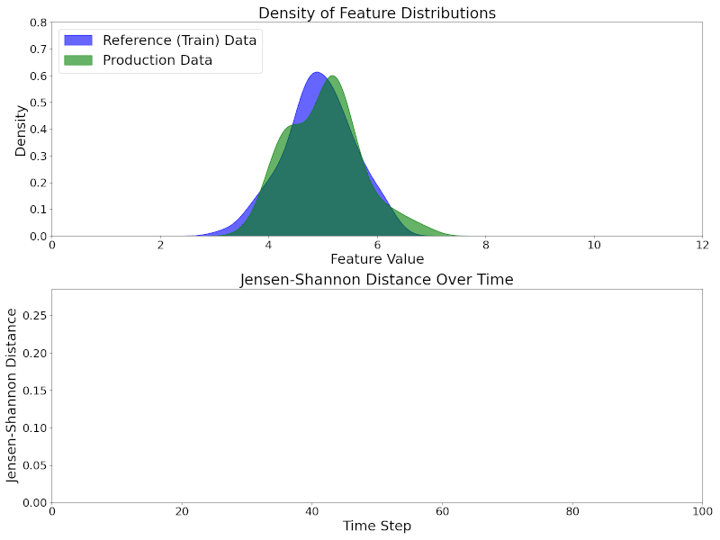
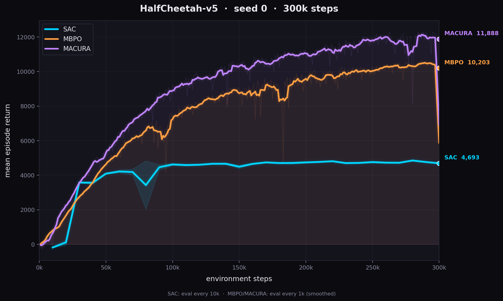
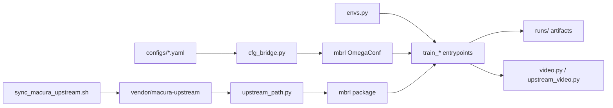

<div align="center">

# rl-bench

### Trust the Model Where It Trusts Itself

**A from-scratch benchmark of SAC, MBPO, and MACURA on Gymnasium MuJoCo.**
*Uncertainty-aware rollout adaption in Dyna-style model-based RL — paper analysis & reimplementation.*

[](https://www.python.org/)
[](https://pytorch.org/)
[](https://gymnasium.farama.org/)
[](https://github.com/astral-sh/uv)
[](https://www.tensorflow.org/tensorboard)
[](LICENSE)

<table>
  <tr>
    <td align="center"><b>MACURA</b><br/></td>
    <td align="center"><b>MBPO</b><br/></td>
    <td align="center"><b>SAC</b><br/></td>
  </tr>
  <tr><td colspan="3" align="center"><sub>Final policies on <code>HalfCheetah-v5</code> @ 300k env steps, seed 0.</sub></td></tr>
</table>

</div>

---

## What is this?

A clean, comparable benchmark harness for three continuous-control algorithms. The training science (probabilistic ensembles, the GJS uncertainty gate, the SAC update) lives in the upstream, peer-reviewed [MACURA paper repository](https://github.com/Data-Science-in-Mechanical-Engineering/macura). **rl-bench drives that core** — it adds flat YAML configs, Gymnasium env wrappers, logging, evaluation, video export, and a config bridge so SAC, MBPO, and MACURA share one harness and stay directly comparable.

> We don't reimplement the ensembles or SAC. We orchestrate, configure, and benchmark them fairly.

| Algorithm | Idea |
|-----------|------|
| **SAC** | Maximum-entropy off-policy actor-critic (twin Q, learned temperature α). The model-free core under all three. |
| **MBPO** | Model-based policy optimization: ensemble dynamics + short imagined rollouts mixed into SAC updates. |
| **MACURA** | MBPO plus a per-step uncertainty gate (GJS divergence) and adaptive rollout depth / update count. |

---

## The big idea: *when* vs *where* to trust the model

Dyna-style model-based RL learns a dynamics model and uses short model rollouts to generate cheap extra data for a model-free agent. Real data is expensive; model data is free — but only useful where the model is accurate. The question is **how far can you roll out before model error corrupts the policy?**

- **MBPO asks "*when?*"** — a fixed, time-based rollout schedule. Same horizon everywhere, regardless of local model error. *Uniform accuracy is a fallacy:* models are accurate near data, poor when extrapolating.
- **MACURA asks "*where?*"** — roll out only while the model is *locally* certain. Each rollout stops once the ensemble's uncertainty crosses a self-tuning threshold. Long where the model is confident, short where it isn't.

<div align="center">
<br/>
<sub>The GJS signal: ensemble agreement (certain) vs drift (uncertain) — the gate that defines where to trust.</sub>
</div>

**The mechanism, in three parts:**
1. **Probabilistic Ensemble** — `E = 7` Gaussian networks trained on bootstrapped real data via NLL. Member *disagreement* = epistemic uncertainty.
2. **GJS uncertainty** — a closed-form Geometric Jensen-Shannon divergence over the ensemble's Gaussians, computed every transition. Defines the trusted region `E = { s : u_GJS(s,a) < κ }`.
3. **Adaptive gate (Algorithm 2)** — keep a rollout step while `u_GJS < κ`, else break. The threshold `κ` self-tunes from the ζ-quantile of first-step uncertainty, scaled by the single knob `ξ`. `T_max = 10` and `ζ = 95%` are fixed across all tasks — far easier to tune than MBPO's schedule.

---

## Results — HalfCheetah-v5, 300k steps, seed 0

**Ranking @ 300k:  MACURA (11,888) > MBPO (10,203) > SAC (4,693)**

<div align="center">

</div>

| Rank | Algorithm | Final return @ 300k | vs SAC | vs MBPO | Rollouts |
|:----:|-----------|:-------------------:|:------:|:-------:|----------|
| 1 | **MACURA** | **11,888** | +7,195 (+153%) | +1,685 (+17%) | uncertainty-gated, T_max = 10, ξ = 2.0 |
| 2 | **MBPO**   | **10,203** | +5,510 (+117%) | — | fixed horizon = 1, G = 8 |
| 3 | **SAC**    | **4,693**  | — | −5,510 | model-free, no model |

**Takeaways (match the paper's story):**
- **Both model-based methods crush model-free SAC** (~2.2–2.5×) — the model massively boosts data efficiency at 300k.
- **MACURA > MBPO** — the *where-to-trust* uncertainty gate beats the fixed 1-step horizon, consistent with the paper's claim.
- **SAC plateaus ~4.7k** while MACURA/MBPO keep climbing — the trade-off is speed (model-based is ~10× slower per step).

> **Caveat — not a paper-faithful reproduction.** Single seed, laptop-scale configs: 256-wide nets (not 1024), G = 8 (not 30), 300k steps (not 400k). Rankings among our three runs are internally fair (same env, steps, exploration); absolute numbers don't transfer to published figures. MBPO/MACURA returns come from upstream epoch-rollout logs (`results.csv`); SAC from deterministic `eval.csv` — the two metrics differ slightly.

---

## Architecture



1. **`scripts/sync_macura_upstream.sh`** clones the paper repo into `vendor/macura-upstream/` (gitignored).
2. **`upstream_path.ensure_upstream()`** prepends it to `sys.path` so `import mbrl` works.
3. **`cfg_bridge.build_mbrl_cfg()`** turns flat YAML into the nested OmegaConf `mbrl.algorithms.*.train()` expects.
4. **Env creation** splits by trainer: MBPO/MACURA use `upstream_env.make_upstream_envs()` (raw `TimeLimit(MujocoEnv)` envs upstream can freeze/restore); SAC uses `envs.make_sac_envs()` (our `RecordEpisodeStatistics` + optional `ObsNormalizer`).
5. **Trainers** call upstream training (MBPO, MACURA) or run a thin SAC loop (SAC only) that still uses upstream's `pytorch_sac_pranz24` and replay buffer.
6. **Artifacts** land under `runs/<algo>_seed{N}/`.

---

## Quick start

```bash
git clone https://github.com/djacoo/rl-bench.git && cd rl-bench
uv sync
bash scripts/sync_macura_upstream.sh   # required before any training
```

Check your accelerator:

```bash
uv run python -c "import torch; print(torch.cuda.is_available())"
```

### Train (Hopper)

```bash
uv run python -m rl_bench.train_sac    --config configs/sac.yaml    --seed 0
uv run python -m rl_bench.train_mbpo   --config configs/mbpo.yaml   --seed 0
uv run python -m rl_bench.train_macura --config configs/macura.yaml --seed 0
```

### Train (HalfCheetah)

```bash
uv run python -m rl_bench.train_sac    --config configs/sac_halfcheetah.yaml    --seed 0
uv run python -m rl_bench.train_mbpo   --config configs/mbpo_halfcheetah.yaml   --seed 0
uv run python -m rl_bench.train_macura --config configs/macura_halfcheetah.yaml --seed 0
```

Multi-seed (default seeds `0 1 2`): `bash scripts/train_sac.sh` (and `train_mbpo.sh` / `train_macura.sh`).

Aggregate learning curves:

```bash
uv run python scripts/plot_runs.py --algos sac mbpo macura --out results/learning_curves.png
```

TensorBoard:

```bash
uv run tensorboard --logdir runs/
```

---

## Repository layout

```
configs/        one YAML per experiment (sac / mbpo / macura × hopper / halfcheetah)
scripts/        sync upstream, multi-seed launchers, plotting
src/rl_bench/   the harness — wrappers, bridge, trainers, eval, logging, video
assets/         policy GIFs + learning-curve figure
docs/           macura-paper.pdf (reference)
vendor/         gitignored clone of the paper repo (the algorithm core)
runs/           gitignored training output per seed
```

<details>
<summary><b>Full file reference</b></summary>

### Upstream integration

| File | Role |
|------|------|
| `scripts/sync_macura_upstream.sh` | Shallow-clones / updates `vendor/macura-upstream` from GitHub (`MACURA_UPSTREAM_REF`, default `master`). Required before any training. |
| `src/rl_bench/upstream_path.py` | Resolves `vendor/macura-upstream` relative to repo root, inserts it at the front of `sys.path`. Clear error if the vendor tree is missing. |
| `src/rl_bench/cfg_bridge.py` | **Config translator.** Maps rl-bench YAML (`sac`, `model`, `train`, `env`, `exploration`) into `mbrl`'s `algorithm`, `overrides`, `dynamics_model` blocks. Maps `env_id` → upstream `env` string and `term_fn`; adjusts `refit_every` so `rollout_M × refit_every` is divisible by `n_members`; sets MACURA fields (`xi`, `zeta`, `max_rollout_length`). |
| `src/rl_bench/upstream_env.py` | `make_upstream_envs()` for MBPO/MACURA: raw `TimeLimit(MujocoEnv)` envs (train + eval/distance) in the exact shape upstream's MuJoCo save/restore expects. No obs wrappers — upstream owns normalization. |
| `src/rl_bench/upstream_agent.py` | Loads `sac.pth` after MBPO/MACURA runs: rebuilds upstream `SAC` + `SACAgent`, wraps with `UpstreamSacAdapter.act()` for eval/video. |
| `src/rl_bench/upstream_video.py` | Post-training hook: if `train.video_every` is set and `sac.pth` exists, reloads it and records one final-policy MP4. |

### Training entrypoints

| File | Role |
|------|------|
| `src/rl_bench/train_sac.py` | **Custom loop:** warmup random actions → upstream SAC policy → optional exploration noise → `ReplayBuffer` → periodic `evaluate()` + `Logger.log_eval()` → checkpoints + inline videos. Writes `sac.pth`. |
| `src/rl_bench/train_mbpo.py` | Thin wrapper: `build_mbrl_cfg` → envs → `mbrl.algorithms.mbpo.train(...)` → `maybe_record_upstream_videos()`. |
| `src/rl_bench/train_macura.py` | Same as MBPO but calls `mbrl.algorithms.macura.train(...)` with the extra `distance_env` for GJS gating. |

### Env, policy helpers, logging

| File | Role |
|------|------|
| `src/rl_bench/envs.py` | `make_env()`: `gym.make` + `RecordEpisodeStatistics` + optional `ObsNormalizer`; eval envs share train RMS stats. **SAC only.** |
| `src/rl_bench/exploration.py` | Action-space noise for SAC training: `stochastic` / `deterministic` / `white` / `pink` (1/f, per-episode buffer). |
| `src/rl_bench/eval.py` | Runs `n_episodes` with fixed eval seeds, deterministic `agent.act()`, returns mean/std/list of returns. |
| `src/rl_bench/logger.py` | Per-run TensorBoard under `tb/` and `eval.csv` (`step, mean, std, min, max`). |
| `src/rl_bench/video.py` | `should_record_video()` + `record_policy_video()` — fresh `rgb_array` env, H.264 MP4 via imageio. |
| `src/rl_bench/utils.py` | `set_seed`, `resolve_device`/`setup_device` (`auto` → CUDA → MPS → CPU), `load_yaml`, `dump_config`. |

### Scripts

| File | Role |
|------|------|
| `scripts/_train_common.sh` | `run_seeds <algo> <config> [seeds...]` (default `0 1 2`). |
| `scripts/train_{sac,mbpo,macura}.sh` | `run_seeds <algo> configs/<algo>.yaml "$@"`. |
| `scripts/plot_runs.py` | Reads `eval.csv` from `runs/<algo>_seed*`, plots mean ± std across seeds. |

### Configs

Shared sections: `algo`, `seed`/`device`, `env` (`env_id`, `max_episode_steps`, `obs_norm`, `eval_seed`), `sac` (replay/warmup/batch/lr/hidden/γ/τ), `model` (MBPO/MACURA: `n_members`, width, `refit_every`, `rollout_M`, `real_ratio`, `updates_G`/`G_max`, MACURA `xi`/`zeta`/`T_max`), `exploration` (`kind` + `scale`), `train` (`total_env_steps`, `eval_every`, `ckpt_every`, optional `video_every`), `paths.run_dir`.

| Config | Environment | Typical steps |
|--------|-------------|---------------|
| `{sac,mbpo,macura}.yaml` | Hopper-v4 | 500k |
| `*_halfcheetah.yaml` | HalfCheetah-v4/v5 | 300k |

</details>

---

## Dependencies

`pyproject.toml` pins runtime libs for this repo (Gymnasium MuJoCo, PyTorch, imageio, colorednoise) **and** for importing upstream (OmegaConf, Hydra, wandb, OpenCV, SciPy — used inside `mbrl`). The ensembles and SAC are **not** reimplemented here; `vendor/macura-upstream` must be synced before training.

## References

- Frauenknecht et al. (2024). *Trust the Model Where It Trusts Itself (MACURA).* ICML.
- Janner et al. (2019). *When to Trust Your Model: Model-Based Policy Optimization.* NeurIPS.
- Haarnoja et al. (2018). *Soft Actor-Critic.* ICML.
- Eberhard et al. (2023). *Pink Noise Is All You Need: Colored Noise Exploration in Deep RL.* ICLR.

## Authors

**Jacopo Parretti** · **Cesare Fraccaroli** — University of Verona, MSc in Artificial Intelligence.

## License

[MIT](LICENSE).
