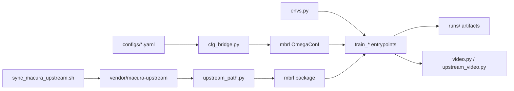

# rl-bench

Benchmark harness for three continuous-control algorithms on Gymnasium MuJoCo. Training logic lives in the upstream [MACURA paper repository](https://github.com/Data-Science-in-Mechanical-Engineering/macura); this repo supplies flat YAML configs, Gymnasium env wrappers, logging, evaluation, and video export.

| Algorithm | Idea |
|-----------|------|
| **SAC** | Maximum-entropy off-policy actor-critic (twin Q, learned temperature). |
| **MBPO** | Model-based policy optimization: ensemble dynamics + short imagined rollouts mixed into SAC updates. |
| **MACURA** | MBPO plus a per-step uncertainty gate (GJS divergence) and adaptive rollout depth / update count. |

## Stack


## How the pieces fit together



1. **`scripts/sync_macura_upstream.sh`** clones the paper repo into `vendor/macura-upstream/` (gitignored).
2. **`upstream_path.ensure_upstream()`** prepends that directory to `sys.path` so `import mbrl` works.
3. **`cfg_bridge.build_mbrl_cfg()`** turns your flat YAML into the nested OmegaConf structure `mbrl.algorithms.*.train()` expects.
4. **`upstream_env.make_train_envs()`** builds Gymnasium train / eval / MACURA-distance envs with optional observation normalization.
5. **Trainers** either call upstream training (MBPO, MACURA) or run a thin SAC loop (SAC only) that still uses upstream’s `pytorch_sac_pranz24` and replay buffer.
6. **Artifacts** land under `paths.run_dir` (default `runs/<algo>_seed{N}/`).

---

## File reference

### Upstream integration

| File | Role |
|------|------|
| [`scripts/sync_macura_upstream.sh`](scripts/sync_macura_upstream.sh) | Shallow-clones or updates `vendor/macura-upstream` from GitHub (`MACURA_UPSTREAM_REF`, default `master`). Required before any training. |
| [`src/rl_bench/upstream_path.py`](src/rl_bench/upstream_path.py) | Resolves `vendor/macura-upstream` relative to the repo root and inserts it at the front of `sys.path`. Raises a clear error if the vendor tree is missing. |
| [`src/rl_bench/cfg_bridge.py`](src/rl_bench/cfg_bridge.py) | **Config translator.** Maps rl-bench YAML keys (`sac`, `model`, `train`, `env`, `exploration`) into `mbrl`’s `algorithm`, `overrides`, and `dynamics_model` blocks. Important behaviors: maps `env_id` → upstream `env` string and `term_fn` (e.g. HalfCheetah → `no_termination`); adjusts `refit_every` so `rollout_M × refit_every` is divisible by `n_members` (upstream batching constraint); sets MACURA-only fields (`xi`, `zeta`, `max_rollout_length`). Does **not** use the paper’s Hydra override YAMLs—you keep full control via `configs/*.yaml`. |
| [`src/rl_bench/upstream_env.py`](src/rl_bench/upstream_env.py) | Builds three envs from one config: **train** (updates obs stats if `obs_norm`), **test** (eval, frozen stats), **distance** (second eval env for MACURA’s divergence env). Resolves `get_term_fn()` from `mbrl.env.termination_fns` using the name from the bridge. |
| [`src/rl_bench/upstream_agent.py`](src/rl_bench/upstream_agent.py) | Loads `sac.pth` after MBPO/MACURA runs: reconstructs upstream `SAC` + `SACAgent`, wraps with `UpstreamSacAdapter.act()` for eval/video code that expects a simple policy interface. |
| [`src/rl_bench/upstream_video.py`](src/rl_bench/upstream_video.py) | Post-training hook for MBPO/MACURA: if `train.video_every` is set and `sac.pth` exists, records MP4s at scheduled steps via `video.record_policy_video()`. |

### Training entrypoints

| File | Role |
|------|------|
| [`src/rl_bench/train_sac.py`](src/rl_bench/train_sac.py) | **Custom loop** (not `mbrl`’s full trainer): warmup random actions → upstream SAC policy → optional exploration noise → `mbrl.util.replay_buffer.ReplayBuffer` → periodic `evaluate()` + `Logger.log_eval()` → checkpoints + inline videos. Writes `sac.pth` at the end. This path exists so SAC gets the same `eval.csv` / TensorBoard layout as your other experiments without relying on upstream’s logging. |
| [`src/rl_bench/train_mbpo.py`](src/rl_bench/train_mbpo.py) | Thin wrapper: `build_mbrl_cfg` → envs → `mbrl.algorithms.mbpo.train(...)`. Upstream owns the model ensemble, imaginary rollouts, and SAC updates. Then `maybe_record_upstream_videos()`. |
| [`src/rl_bench/train_macura.py`](src/rl_bench/train_macura.py) | Same as MBPO but calls `mbrl.algorithms.macura.train(...)` with the extra `distance_env` for GJS-based gating. |

### Environment, policy helpers, logging

| File | Role |
|------|------|
| [`src/rl_bench/envs.py`](src/rl_bench/envs.py) | `make_env()`: `gym.make` + `RecordEpisodeStatistics` + optional `ObsNormalizer` (`RunningMeanStd`). Eval envs can share the train env’s RMS stats so normalization is consistent at test time. |
| [`src/rl_bench/exploration.py`](src/rl_bench/exploration.py) | Action-space noise for **SAC training only**: `stochastic` / `deterministic` (no extra noise), `white`, or `pink` (1/f, per-episode buffer). MBPO/MACURA exploration type is passed through the bridge as upstream `exploration_type_env`. |
| [`src/rl_bench/eval.py`](src/rl_bench/eval.py) | Runs `n_episodes` with fixed eval seeds (`eval_seed + i`), deterministic `agent.act()`, returns mean/std/list of returns. Used by `train_sac.py`. |
| [`src/rl_bench/logger.py`](src/rl_bench/logger.py) | Per-run logging: TensorBoard under `tb/`, append-only `metrics.jsonl`, and `eval.csv` with columns `step, mean, std, min, max`. |
| [`src/rl_bench/video.py`](src/rl_bench/video.py) | `should_record_video(step, total, video_every)` — true on multiples of `video_every` and on the final step. `record_policy_video()` builds a fresh `rgb_array` env, rolls out the policy, writes H.264 MP4 with imageio (no MoviePy). |
| [`src/rl_bench/utils.py`](src/rl_bench/utils.py) | `set_seed`, `resolve_device` / `setup_device` (`auto` → CUDA → MPS → CPU), `load_yaml`, `dump_config` (copies resolved YAML into the run dir). |

### Shell scripts and plotting

| File | Role |
|------|------|
| [`scripts/_train_common.sh`](scripts/_train_common.sh) | Defines `run_seeds <algo> <config> [seeds...]` (default seeds `0 1 2`). |
| [`scripts/train_sac.sh`](scripts/train_sac.sh) | `run_seeds sac configs/sac.yaml "$@"` |
| [`scripts/train_mbpo.sh`](scripts/train_mbpo.sh) | `run_seeds mbpo configs/mbpo.yaml "$@"` |
| [`scripts/train_macura.sh`](scripts/train_macura.sh) | `run_seeds macura configs/macura.yaml "$@"` |
| [`scripts/plot_runs.py`](scripts/plot_runs.py) | Reads `eval.csv` from `runs/<algo>_seed*`, plots mean return ± std across seeds, saves a PNG (default `results/learning_curves.png`). |

### Configs (`configs/`)

Each file is a single experiment recipe. Shared top-level sections:

| Section | Purpose |
|---------|---------|
| `algo` | `sac`, `mbpo`, or `macura` — selects bridge algorithm block and trainer. |
| `seed` / `device` | RNG seed; `device: auto` or `cpu` / `cuda` / `mps`. |
| `env` | `env_id` (e.g. `Hopper-v4`), `max_episode_steps`, `obs_norm`, `eval_seed`, `render` (train window; usually `false`). |
| `sac` | Replay capacity, warmup, batch, learning rates, `hidden` (actor/critic width for bridge), γ, τ. |
| `model` | **MBPO/MACURA only:** ensemble size/elites, MLP width, `refit_every`, `rollout_M`, `real_ratio`, `updates_G` / `G_max`, MACURA `xi` / `zeta` / `T_max`. |
| `exploration` | `kind` + `scale` (see `exploration.py` / bridge mapping). |
| `train` | `total_env_steps`, `eval_every`, `eval_episodes`, `log_every`, `ckpt_every` (SAC), optional `video_every` / `video_episodes`. |
| `paths.run_dir` | Output directory template, e.g. `runs/mbpo_seed{seed}`. |

| Config | Environment | Typical steps |
|--------|-------------|---------------|
| `sac.yaml`, `mbpo.yaml`, `macura.yaml` | Hopper-v4 | 500k |
| `*_halfcheetah.yaml` | HalfCheetah-v4 | 300k |

Change `paths.run_dir` when you must not overwrite an existing `runs/*_seed0/`.

### Directories outside `src/`

| Path | Purpose |
|------|---------|
| `vendor/macura-upstream/` | Gitignored clone of the paper repo; contains `mbrl/` (algorithms, models, SAC fork, termination functions). |
| `runs/` | Gitignored training output per seed (see below). |
| `old_runs/` | Gitignored archive of past experiments. |
| `results/` | Committed **summaries** under `results/halfcheetah/` (`config.yaml`, `eval.csv`, `metrics.jsonl`); local PNG plots and heavy artifacts are gitignored. |
| `docs/halfcheetah_comparison.md` | Notes comparing this repo’s HalfCheetah settings to the paper and a friend’s run. |

### What each run directory contains

After training, `runs/<name>_seed<N>/` typically includes:

| Artifact | Produced by |
|----------|-------------|
| `config.yaml` | Copy of the YAML used (`dump_config`) |
| `eval.csv` | SAC trainer eval rollouts; upstream may also write eval logs for MBPO/MACURA |
| `metrics.jsonl` | SAC scalar logs (when used) |
| `tb/` | TensorBoard event files |
| `sac.pth` | Final SAC weights (all algorithms save this name upstream) |
| `ckpt_*.pt` | SAC periodic checkpoints |
| `videos/step_*.mp4` | Optional policy rollouts |

---

## Quick start

```bash
git clone <repo-url> rl-bench && cd rl-bench
uv sync
bash scripts/sync_macura_upstream.sh
```

```bash
uv run python -c "import torch; print(torch.cuda.is_available())"
```

### Hopper

```bash
uv run python -m rl_bench.train_sac    --config configs/sac.yaml    --seed 0
uv run python -m rl_bench.train_mbpo   --config configs/mbpo.yaml   --seed 0
uv run python -m rl_bench.train_macura --config configs/macura.yaml --seed 0
```

### HalfCheetah

```bash
uv run python -m rl_bench.train_sac    --config configs/sac_halfcheetah.yaml    --seed 0
uv run python -m rl_bench.train_mbpo   --config configs/mbpo_halfcheetah.yaml   --seed 0
uv run python -m rl_bench.train_macura --config configs/macura_halfcheetah.yaml --seed 0
```

Multi-seed: `bash scripts/train_sac.sh` (and `train_mbpo.sh` / `train_macura.sh`).

Aggregate curves:

```bash
uv run python scripts/plot_runs.py --algos sac mbpo macura --out results/learning_curves.png
```

TensorBoard:

```bash
uv run tensorboard --logdir runs/
```

---

## Dependencies note

`pyproject.toml` pins runtime libs for **this repo** (Gymnasium MuJoCo, PyTorch, imageio, colorednoise, etc.) and for **importing upstream** (OmegaConf, Hydra, wandb, OpenCV, SciPy—used inside `mbrl` even if you never launch wandb yourself). SAC/MBPO/MACORA **weights and ensembles are not reimplemented here**; deleting `vendor/macura-upstream` does not remove the need to sync it before training.
