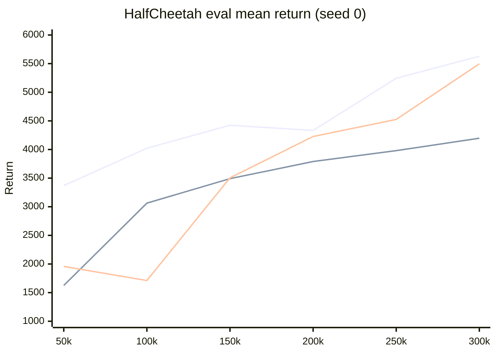

# HalfCheetah-v5 Comparison (Draft)

Comparison of **SAC**, **MBPO**, and **MACURA** on `HalfCheetah-v5`, seed 0, **300k** environment steps.

> **Status:** draft — single seed, laptop-scale configs; **not** paper-faithful. See [deviations](#deviations-from-macura--mbpo-papers-machine--time-limitations).

---

## Key highlights

> **Ranking @ 300k (seed 0):** **SAC (5629)** > **MACURA (5497)** > **MBPO (4197)**

| Insight | Detail |
|--------|--------|
| **Winner** | SAC beats MACURA by **+132** (~2.4%); beats MBPO by **+1432** (~34%) |
| **MACURA vs MBPO** | Uncertainty gating helps: **+1300** over MBPO — aligns with MACURA paper |
| **MBPO vs papers** | MBPO **plateaued ~4.2k** from ~150k; papers expect **≈ SAC** by ~400k |
| **Sample efficiency** | Papers: MBPO faster early. **Us:** SAC led at **every** checkpoint (50k–300k) |
| **Speed** | SAC **~107 it/s** vs MBPO **~11 it/s** (~10×) on same machine |
| **Fair comparison?** | **Yes** across our three runs (same env, steps, pink noise). **No** vs ICML 2024 / NeurIPS 2019 without retuning |

**Largest gaps vs MACURA paper (HalfCheetah):** 300k not 400k steps · **256**-wide nets not **1024** · MBPO **G=8** not **30** · friend **G_max=16** not **60** · **ξ=2.0** not **0.3**

---

## Executive summary

### Final results @ 300k

| Rank | Algorithm | Mean return | Std | vs SAC | vs MBPO |
|:----:|-----------|------------|-----|--------|---------|
| 1 | **SAC** | **5629.5** | 43 | — | **+1432** |
| 2 | **MACURA** (friend, run A) | **5497.4** | 193 | −132 | **+1300** |
| 3 | **MBPO** | **4197.0** | 35 | −1432 | — |

### Four takeaways

1. **SAC** — best final score; still climbing at 300k (**+385** from 250k→300k).
2. **MACURA** — near-SAC performance with **noisy** evals (std **193** at 300k); strong late surge (**+1270** from 200k→300k).
3. **MBPO** — **flat ~4.2k** after ~150k; low std = plateau, not stability at high reward.
4. **Papers vs us** — MBPO should match SAC and lead early; **neither held** under our shortened, reduced configs.

---

## Head-to-head comparisons

### Return gaps (absolute)

```
SAC     ████████████████████████████████████████  5629
MACURA  ██████████████████████████████████████    5497  (−2.4% vs SAC)
MBPO    ██████████████████████████████            4197  (−25% vs SAC, −24% vs MACURA)
```

### Learning speed (who led at each checkpoint?)

| Step | Leader | SAC | MBPO | MACURA | Note |
|------|--------|-----|------|--------|------|
| 50k | **SAC** | 3369 | 1625 | 1958 | MBPO/MACURA still ramping |
| 100k | **SAC** | 4022 | 3063 | 1712 | MACURA dip |
| 150k | **SAC** | 4424 | 3491 | 3505 | MBPO ≈ MACURA |
| 200k | **SAC** | 4333 | 3790 | 4227 | SAC brief dip |
| 250k | **SAC** | 5244 | 3980 | 4525 | SAC pulls away |
| 300k | **SAC** | **5629** | 4197 | 5497 | MACURA closes gap |

> **Paper expectation:** MBPO curve **above** SAC early, **merging** near 400k. **Observed:** SAC **ahead throughout**.

### Late-training momentum (150k → 300k)

| Algorithm | Δ return | Interpretation |
|-----------|----------|----------------|
| **SAC** | **+1205** | Still learning |
| **MACURA** | **+992** | Strong recovery / late gain |
| **MBPO** | **+706** | Slowing; effectively saturating |

---

## Setup

### Shared settings

| Parameter | Value |
|-----------|-------|
| Environment | `HalfCheetah-v5` |
| Seed | 0 |
| Env steps | **300,000** |
| Obs normalization | on |
| Exploration | pink noise, scale=0.05 |
| Warmup | 5,000 |
| Eval | every 10k · 10 episodes |

### Algorithm-specific (important deltas)

| Parameter | SAC | MBPO | MACURA (friend) |
|-----------|:---:|:----:|:---------------:|
| Real env data in batch | **100%** | **10%** | **10%** |
| Updates / env step | **1** | **8** | **≤16** adaptive |
| Rollout horizon | — | **1** (fixed) | **≤10** (gated) |
| Model buffer | — | 400k | 400k |
| Device | MPS | MPS | **CPU** (M3) |
| Throughput | **~107 it/s** | **~11 it/s** | **~15 it/s** |

---

## Deviations from MACURA / MBPO papers (machine & time limitations)

> **Bottom line:** Runs are **internally comparable** (same 300k HalfCheetah-v5 budget) but **not** comparable to published Figure 2 / Figure 4 curves without retuning.

Reference: Frauenknecht et al. (2024) Tables 4–5 · Janner et al. (2019) Appendix C.

### Critical parameter changes

| Parameter | MACURA paper | Friend MACURA | Our SAC / MBPO | Why changed |
|-----------|:------------:|:-------------:|:--------------:|-------------|
| **Env steps** | **400k** | 300k | 300k | Wall-clock (~7.5h+ for MBPO) |
| **Actor/critic** | **3×1024** | 256×2 | 256×2 | Memory & speed on Mac |
| **MBPO G** | **30** | — | **8** | CPU/MPS time per step |
| **MACURA G_max** | **60** | **16** | — | Friend CPU budget |
| **MACURA ξ** | **0.3** | **2.0** | — | Not per-env tuned |
| **`real_ratio`** | **0.05** | 0.10 | 0.10 (MBPO) | Simpler / slightly more real data |
| **Device** | GPU (mbrl-lib) | CPU | MPS | Hardware available |
| **Seeds** | 5 (mean±std) | **1** | **1** | Time |

↓ = reduced from paper · ↑ = extra overhead

### Fairness matrix

| Comparison | Valid? |
|------------|:------:|
| SAC vs MBPO vs MACURA @ 300k, same repo family | **Yes** |
| vs MACURA paper Figure 4 | **No** |
| vs MBPO paper Figure 2 | **No** |
| Friend MACURA vs our SAC/MBPO | **~Partial** (env/steps match; G, device differ) |

> **Paper-faithful MACURA rerun would need:** 400k steps · G_max≈60 · ξ≈0.3 · real_ratio=0.05 · 1024-wide nets · GPU/mbrl-lib-style tuning.

### Rationale (short)

- **300k not 400k** — align all three algorithms; MBPO at 11 it/s is already multi-hour.
- **Small nets (256)** — `rl-bench` defaults; avoids OOM on laptop.
- **Low G / G_max** — main lever to make model-based training tractable on Mac.
- **HalfCheetah-v5** — Gymnasium stack, not paper’s v2.

---

## Eval learning curves (mean return)

| Step | SAC | MBPO | MACURA (A) | Leader |
|------|-----|------|------------|--------|
| 50k | 3369 | 1625 | 1958 | SAC |
| 100k | 4022 | 3063 | 1712 | SAC |
| 150k | 4424 | 3491 | 3505 | SAC |
| 200k | 4333 | 3790 | 4227 | SAC |
| 250k | 5244 | 3980 | 4525 | SAC |
| **300k** | **5629** | **4197** | **5497** | **SAC** |



### Phase notes

| Phase | What happened |
|-------|----------------|
| **Early (10k–100k)** | SAC leads; MBPO/MACURA unstable (low/negative checkpoints) |
| **Mid (100k–200k)** | MBPO steady climb; MACURA volatile then ~4.2k @ 200k |
| **Late (200k–300k)** | SAC + MACURA surge; **MBPO flat ~4.2k** |

---

## Stability

| Metric | SAC | MBPO | MACURA (A) |
|--------|-----|------|------------|
| Final eval std | 43 | 35 | **193** ⚠️ |
| Worst eval min | 1497 @ 200k | **−100** @ 20k | **−862** @ 110k |
| Late plateau? | No | **Yes (~4k)** | No (noisy ↑) |

> MBPO’s **low std** = stuck near 4.2k, not high-performance stability. MACURA’s **high std** = few eval episodes + policy variance.

---

## Papers vs our results

| Paper claim | Expected | **Observed (seed 0)** | Match? |
|-------------|----------|------------------------|:------:|
| MBPO ≈ SAC asymptotically (Janner 2019) | Curves merge ~400k | Gap **≈1432** @ 300k | ❌ |
| MBPO faster than SAC early (Janner 2019) | MBPO above SAC | SAC ahead 50k–300k | ❌ |
| Model error caps model-based peak (theory) | Plateau possible | MBPO ~4.2k plateau | ✅ |
| MACURA > MBPO (Frauenknecht 2024) | Higher final return | **+1300** | ✅ |
| MACURA ≈ SAC (Frauenknecht 2024) | Comparable asymptotic | **−2.4%** | ✅ |

---

## Caveats

- **Single seed** — papers report 5-trial mean ± std.
- **MACURA log duplicated** — two 300k runs appended; **run A** used here (run B final = **5042**).
- **Not paper configs** — see [deviations](#deviations-from-macura--mbpo-papers-machine--time-limitations).
- Friend MACURA: `live_plot: true` (extra overhead).

---

## Artifacts

| Run | Path | Videos |
|-----|------|:------:|
| SAC | `runs/sac_halfcheetah_seed0/` | 3 |
| MBPO | `runs/mbpo_halfcheetah_seed0/` | 3 |
| MACURA | `runs/macura_seed0/` | 0 |

TensorBoard: `runs/<algo>_*/tb/`

---

## Open questions / next steps

- [ ] **Fair MBPO retry:** `updates_G=30`, `real_ratio=0.05`, target entropy −4
- [ ] **Multi-seed** (0–2) for mean ± std
- [ ] **Clean MACURA eval** (split run A/B)
- [ ] **Extend to 500k** — SAC/MACURA may gain; MBPO likely stays ~4.2k without retune
- [ ] Compare videos @ 100k / 200k / 300k

---

## References

- Janner et al. (2019). *When to Trust Your Model: Model-Based Policy Optimization.* NeurIPS.
- Frauenknecht et al. (2024). *Trust the Model Where It Trusts Itself (MACURA).* ICML.
